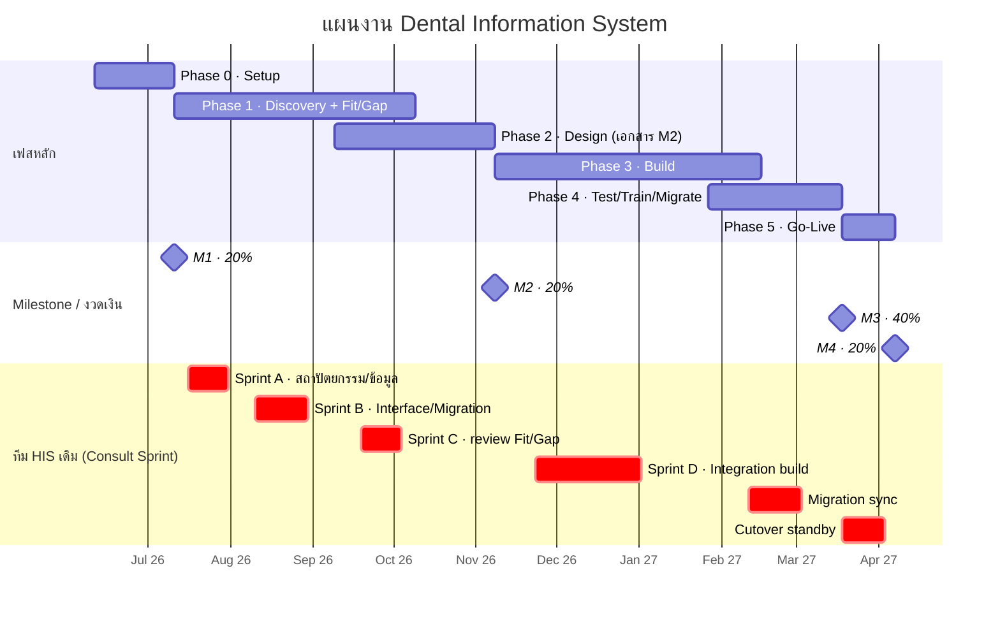

# แผนดำเนินงานพัฒนา “ระบบจัดเก็บข้อมูลสารสนเทศด้านทันตกรรม (Dental Information System)”
### Fit/Gap Analysis + Development + ขั้นตอนที่จำเป็นตามแนวทาง TOR
มหาวิทยาลัยวลัยลักษณ์ — คณะทันตแพทยศาสตร์ / โรงพยาบาลทันตกรรม

> 📎 **เอกสารที่เกี่ยวข้อง:** [หน้ารวม (index.html)](index.html) · [แผนฉบับ HTML](แผนดำเนินงาน-FitGap-Develop.html) · [เอกสารส่งมอบรายงวด + มาตรฐาน](เอกสารส่งมอบรายงวด.html) · [Template 38 ฉบับ](templates/)

---

## 0. สรุปสาระสำคัญจาก TOR (ใช้เป็นกรอบของแผน)

| หัวข้อ | สาระสำคัญ |
|---|---|
| ชื่องาน | ระบบจัดเก็บข้อมูลสารสนเทศด้านทันตกรรม จำนวน 1 ระบบ (Dental Information System) |
| วงเงิน | 9,600,000 บาท |
| ระยะเวลา | **ต้องแล้วเสร็จภายใน 300 วัน** นับจากวันลงนาม/แจ้งเริ่มงาน (NTP) |
| วันเซ็นสัญญา (NTP) | **11/06/2026** (พฤหัสบดี) → ครบ 300 วัน = **07/04/2027** |
| การรับประกัน | **2 ปี** หลังส่งมอบ + ผูก SLA (ดูข้อ 8) |
| มาตรฐานบังคับ | ISO 29110, HA (Healthcare Accreditation), Made in Thailand, แต้มต่อ SME — [ดูคำอธิบาย + เอกสารส่งมอบรายงวด](เอกสารส่งมอบรายงวด.html#std) |
| รูปแบบระบบ | Web Application + Mobile App (Patient / Student / Dentist) ทำงาน Real-time, Fully Integrated |
| ระบบเดิมที่ต้องเชื่อมต่อ | **HAIT Plus (HIS เดิม)**, WU-HRMS, SAP (IM/PU/GL/AP/AR/AA/CO/FM), PACS, LIS/RIS |

> **บริบทของเรา:** เรามี Software HIS ของเราอยู่แล้ว จึงต้องทำ **Fit/Gap ก่อน** เพื่อดูว่าของเดิมตอบ TOR ได้แค่ไหน ส่วนไหนต้อง Config ส่วนไหนต้อง Develop ใหม่ และ — ประเด็นสำคัญที่สุด — **เราไม่มีผู้เชี่ยวชาญ HIS เดิมในทีมตัวเอง ต้องยืมคนจากทีม HIS เดิมมาเป็นช่วง ๆ และต้อง Sync/Consult กับทีมเดิมตลอด** → แผนนี้จึงออกแบบโดยถือ “เวลาของทีม HIS เดิม” เป็นทรัพยากรคอขวดบนเส้นทางวิกฤต (critical path)

### กรอบเวลา (Deadline สะสมจาก TOR ข้อ 8 — คำนวณจริงจากวันเซ็น 11/06/2026)
| Milestone | Day | วันครบกำหนด | งวดเงิน | สาระ |
|---|---|---|---|---|
| เซ็นสัญญา (NTP) | 0 | 11/06/2026 (พฤ.) | — | เริ่มนับเวลา |
| M1 เตรียมความพร้อม | 30 | **11/07/2026 (เสาร์)** ⚠️ | 20% | แผนบริหารโครงการทั้ง 9 ฉบับ (ข้อ 6.1), โครงสร้างทีม |
| M2 วิเคราะห์/ออกแบบ (System Requirement) | 150 | **08/11/2026 (อาทิตย์)** ⚠️ | 20% | **Fit/Gap + งานออกแบบทั้งหมดต้องเสร็จในงวดนี้** |
| M3 ทดสอบ + ฝึกอบรม | 280 | **18/03/2027 (พฤ.)** | 40% | ติดตั้ง, Master Data, UAT (Process Owner), อบรม, E2E, Migrate |
| M4 ติดตั้งใช้งานจริง (Go-Live) | 300 | **07/04/2027 (พุธ)** | 20% | Cutover + ส่งมอบ |

> ⚠️ **M1 (11/07/2026) ตรงวันเสาร์ และ M2 (08/11/2026) ตรงวันอาทิตย์** → ในทางปฏิบัติควรส่งมอบให้เสร็จภายใน “วันทำการก่อนหน้า” (M1 ภายในศุกร์ 10/07/2026, M2 ภายในศุกร์ 06/11/2026) และควรเช็ควันหยุดราชการ/วันหยุดนักขัตฤกษ์ของช่วงนั้นประกอบ
> หมุดเวลาภายในที่สำคัญ: **จบ Fit/Gap Workshop ~09/10/2026 (Day 120)** · **จบ Build/SIT ~16/02/2027 (Day 250)**

---

## 1. หลักการวางแผน (ออกแบบรอบข้อจำกัด “ทีม HIS เดิม”)

1. **Front-load การใช้ทีม HIS เดิม** — งานที่ต้องพึ่งความรู้ HIS เดิม (Fit/Gap, Interface, Data Migration mapping) ต้องดันมาทำให้เร็วและจองคิวทีมเดิมไว้ล่วงหน้าทั้งก้อน
2. **Batch + จองเป็น “Consult Sprint”** — รวบคำถาม/ประเด็นเป็นชุด แล้วใช้เวลาทีมเดิมแบบเข้มข้นเป็นช่วง ๆ แทนการถามกระจัดกระจาย
3. **Capture ความรู้ทุกครั้ง** — ทุก session ต้องบันทึก (อัดวิดีโอ/บันทึกการประชุม) + ทำเอกสารทันที เพื่อสร้างความรู้ในทีมเราเอง ลดการพึ่งพารอบถัดไป
4. **Async-first** — สิ่งที่ทำเองได้ก่อน (อ่านโค้ด/DB/เอกสารเดิม, ตั้งคำถาม) ทำให้เสร็จก่อนเข้าพบทีมเดิม เพื่อให้เวลาที่มีจำกัดคุ้มที่สุด
5. **ทำสัญญาระดับบริการกับทีม HIS เดิม (MOU/Back-to-back SLA)** — ระบุจำนวนวัน/คน, lead time การจอง, ช่องทาง escalation ให้ชัดตั้งแต่ต้น

---

## 2. โครงสร้างเฟสงาน (Flow)

```mermaid
flowchart LR
  P0["🚀 Phase 0<br/>Setup &amp; Mobilization<br/>11/06–11/07/26"]
  M1{{"◆ M1 · 20%<br/>11/07/26"}}
  subgraph P12["Phase 1 + 2 · ทำคู่ขนาน"]
    direction TB
    P1["Phase 1<br/>Discovery + Fit/Gap<br/>11/07–09/10/26"]
    P2["Phase 2<br/>Design (เอกสาร M2)<br/>10/09–08/11/26"]
  end
  M2{{"◆ M2 · 20%<br/>08/11/26"}}
  subgraph P34["Phase 3 + 4 · ทำคู่ขนาน"]
    direction TB
    P3["Phase 3<br/>Build (Config+Develop)<br/>08/11/26–16/02/27"]
    P4["Phase 4<br/>Test · Train · Migrate<br/>27/01–18/03/27"]
  end
  M3{{"◆ M3 · 40%<br/>18/03/27"}}
  P5["🎯 Phase 5<br/>Go-Live + Hypercare<br/>18/03–07/04/27"]
  M4{{"◆ M4 · 20%<br/>07/04/27"}}
  P6["🛡️ Phase 6<br/>Warranty &amp; Support<br/>08/04/27–07/04/29"]
  P0 --> M1 --> P12 --> M2 --> P34 --> M3 --> P5 --> M4 --> P6
```

> เฟสที่ทำคู่ขนาน: **Phase 1+2** (Discovery/Fit-Gap ทับ Design) และ **Phase 3+4** (Build ทับ Test/Train)

---

## 2.1 แผนภูมิ Gantt (ตามวันจริง 11/06/2026 → 07/04/2027)

> **สิ่งที่ Gantt เผยให้เห็น (ควรเพิ่ม/ระวัง):**
> - **เส้นทางวิกฤตซ้อนกัน** — Phase 1↔2 (ก.ย.–ต.ค.) และ Phase 3↔4 (ก.พ.–มี.ค.) ต้องมีกำลังคนทำคู่ขนาน
> - **ไม่มี buffer** — ควรเพิ่ม buffer 5–10 วัน ก่อน M2 และก่อน Go-Live
> - **วันหยุดคาบเกี่ยว** — ปีใหม่ 1 ม.ค. 2027 (กลางเฟส Build), 13/23 ต.ค. (ปลาย Fit/Gap); M1 ตรงเสาร์ / M2 ตรงอาทิตย์
> - **ทีม HIS เดิม 6 ช่วง** — Sprint A–D + Migration sync + Cutover standby ต้องล็อกปฏิทินใน MOU ตั้งแต่ Day 0

---

## 2.2 Resource Loading — ภาระงานทีมรายเดือน

| เดือน | ช่วงงาน | โหลด | กราฟ |
|---|---|---:|---|
| มิ.ย. 26 | Setup | 30% | `███` |
| ก.ค. 26 | Fit/Gap | 60% | `██████` |
| ส.ค. 26 | Fit/Gap | 75% | `███████▌` |
| 🔴 ก.ย. 26 | Fit/Gap + Design | 95% | `█████████▌` |
| 🔴 ต.ค. 26 | Fit/Gap + Design | 100% | `██████████` |
| พ.ย. 26 | Build | 85% | `████████▌` |
| ธ.ค. 26 | Build | 80% | `████████` |
| ม.ค. 27 | Build | 85% | `████████▌` |
| 🔴 ก.พ. 27 | Build + Test | 100% | `██████████` |
| 🔴 มี.ค. 27 | Test + Go-Live | 95% | `█████████▌` |
| เม.ย. 27 | Hypercare | 60% | `██████` |

> 🔴 **2 ยอดที่ทีมเกือบเต็มกำลัง:** **ก.ย.–ต.ค. 2026** (Fit/Gap ทับ Design) และ **ก.พ.–มี.ค. 2027** (Build ทับ Test/Train) → วางคนสำรอง/OT เฉพาะ 2 ช่วงนี้, เลี่ยงลาพักร้อนทีมหลัก, ดึงงานที่ทำได้ล่วงหน้า (เช่น เขียน Test Case ตั้งแต่มี SRS) มาเกลี่ยโหลด

---

## 3. Phase 0 — Setup & Mobilization  (11/06–11/07/2026 · Day 0–30 → M1, 20%)

**เป้าหมาย:** ตั้งโครงการให้พร้อม + ส่งมอบแผนบริหารโครงการครบตาม TOR ข้อ 6.1

- **3.1 Project Kick-off & Governance**
  - ตั้งคณะทำงาน, RACI, ช่องทางสื่อสาร, ปฏิทินโครงการ (อิง deadline 30/150/280/300)
  - จัดตั้งทีมตามที่ TOR กำหนด (PM, System Analyst, System Engineer, Senior/Programmer x3, DBA, DB Analyst/Designer, Sr. Data Engineer, Tester/QA, Project Coordinator, UI/UX)
- **3.2 จัดทำแผนบริหารโครงการ 9 ฉบับ (ส่งมอบงวด M1)**
  1) แผนดำเนินงานภาพรวม 2) แผนสำรวจ/ออกแบบ 3) แผน Database Migration 4) แผนติดตั้ง 5) แผน Implementation 6) แผนทดสอบ (Simulation) 7) แผนฝึกอบรม/ถ่ายทอด 8) แผนกู้คืนระบบ + คู่มือ 9) **แผนบริหารการเปลี่ยนแปลง (Change Management)**
- **3.3 ★ ตั้ง “HIS-Team Engagement Model”** (งานเพิ่มเติมที่ TOR ไม่ได้สั่ง แต่จำเป็นกับบริบทเรา)
  - ทำ MOU/SLA กับทีม HIS เดิม: ระบุโควตาวัน-คน, lead time จองล่วงหน้า, ผู้ประสานงานหลัก (Single Point of Contact), ตารางช่วงเวลาที่ขอคนได้
  - จองคิว **Consult Sprint ก้อนใหญ่ของ Fit/Gap ไว้ล่วงหน้าทั้งหมด** (เพราะอยู่บน critical path)
- **3.4 เตรียม Environment & Access** — ขอสิทธิ์เข้าถึงเอกสาร/Schema/Source ของ HIS เดิม (HAIT Plus), ตั้ง Dev/Test environment, repo, เครื่องมือ ALM/issue tracker

**Exit M1:** แผน 9 ฉบับผ่านการอนุมัติ + ทีม + Engagement Model + คิวทีมเดิมถูกจองแล้ว

---

## 4. Phase 1 — Discovery + Fit/Gap Analysis  (11/07–09/10/2026 · Day 30–120, อยู่ใน M2)

> หัวใจของโครงการ และเป็นจุดที่ต้องใช้ทีม HIS เดิมเข้มข้นที่สุด

- **4.1 แตกความต้องการเป็น Requirement Traceability Matrix (RTM)**
  - แปลงทุกข้อใน **ภาคผนวก ก** (ระบบ HIS ข้อ 1.x ทั้งหมด + ระบบการเรียนการสอน ข้อ 2.x), **ภาคผนวก ข** (เทคนิค), **ภาคผนวก ค** (ครุภัณฑ์) เป็นรายการ requirement ละบรรทัด มีรหัสอ้างอิง
  - (รายการโมดูลหลักดูภาคผนวกท้ายเอกสารนี้)
- **4.2 Inventory ระบบเดิมของเรา** — ทำบัญชีความสามารถ HIS ปัจจุบัน (ฟังก์ชัน, โครงสร้างข้อมูล, API, รายงาน) — *งานนี้ต้องการทีม HIS เดิม*
- **4.3 Fit/Gap Workshop ราย Module** — จับคู่ requirement ↔ ความสามารถเดิม แล้วจัดประเภท:

  | ผล | ความหมาย | การดำเนินการ |
  |---|---|---|
  | **Fit** | ระบบเดิมรองรับอยู่แล้ว | ทดสอบยืนยัน |
  | **Config** | รองรับได้ด้วยการตั้งค่า | ปรับ Configuration Table |
  | **Partial** | รองรับบางส่วน | ปรับ/ต่อยอด |
  | **Gap** | ไม่มี ต้องพัฒนาใหม่ | เข้า Backlog พัฒนา |

- **4.4 Fit/Gap ด้าน Integration & ข้อมูล** (พึ่งทีมเดิมสูง)
  - Interface กับ **HAIT Plus (HIS เดิม)**, SAP, PACS, LIS/RIS, WU-HRMS → ทำ **API Spec / Data Interface mapping**
  - ทำ **Data Migration Mapping** (โครงสร้างข้อมูลเดิม → ใหม่), Data Dictionary
- **4.5 จัดลำดับ Gap Backlog + ประเมิน effort** → ตัดสินใจ Build vs Config, ระบุงานที่เป็นความเสี่ยง

**การใช้ทีม HIS เดิมในเฟสนี้ (จัดเป็น Consult Sprint):**
- Sprint A — ความเข้าใจสถาปัตยกรรม/ข้อมูล HIS เดิม
- Sprint B — ยืนยัน Interface/API + Data Migration mapping
- Sprint C — review ผล Fit/Gap + ข้อสรุปการเชื่อมต่อ
- ทุก Sprint: เตรียมคำถามล่วงหน้า → ประชุมเข้ม → บันทึก/ถอดความรู้ทันที

---

## 5. Phase 2 — Design  (10/09–08/11/2026 · Day 90–150, ปิดท้าย M2 → ส่งมอบงวด 20%)

ออกแบบรายละเอียดของส่วนที่ต้องพัฒนา/ปรับ และจัดทำ **เอกสารส่งมอบ M2 ทั้งหมดตาม TOR ข้อ 8**:
- Workflow Diagram (As-is/To-be), System Requirement Specification, BPM
- Data Mapping, **User Authorization Matrix**, API Spec, Migration Data Mapping
- Technical Specification, Data Dictionary, **System Architecture**, Database Schema Design
- ออกแบบ UX/UI (ตามทีม UI/UX ใน TOR) + ออกแบบความปลอดภัย (OWASP, Zero Trust, TLS, Audit Log ตามภาคผนวก ก ส่วนความปลอดภัย)

**Exit M2 (08/11/2026, Day 150):** เอกสารวิเคราะห์/ออกแบบครบ + Fit/Gap result + Backlog ที่อนุมัติแล้ว → เบิกงวด 20%

---

## 6. Phase 3 — Build (Config + Develop)  (08/11/2026–16/02/2027 · Day 150–250, อยู่ใน M3)

- **6.1 Configure ส่วนที่เป็น Fit/Config** ตาม Configuration Table
- **6.2 พัฒนา Gap** ราย module (เวชระเบียน, Patient bank, ห้องยา/เภสัช, คลินิก, แลป LIS, รังสี/PACS, Dental Lab, นัดหมาย, บัญชีลูกหนี้/เบิกจ่าย, พัสดุคงคลัง, เอกสาร, Consent, ขออนุมัติ, นำเข้า-ส่งออกข้อมูล ฯลฯ)
- **6.3 พัฒนา Integration/Interface** กับ HAIT Plus, SAP, PACS, LIS/RIS — *ช่วงนี้ยังต้อง Sync ทีมเดิมเป็นช่วง ๆ (Consult Sprint D)*
- **6.4 พัฒนา Mobile App** 3 ตัว: Patient / Student / Dentist (เตรียม deploy ขึ้น App Store / Google Play ตาม TOR ข้อ 6.3.5)
- **6.5 สร้างชุด Data Migration** (ETL) + Dry-run รอบแรก
- **6.6 ทดสอบ Unit + System Integration Test (SIT)**

> **กลยุทธ์ลดการพึ่งทีมเดิม:** จุด Integration ที่ต้องอาศัยทีมเดิม ให้รวบทำใน Sprint เดียว + ทำ mock/stub ของ HAIT Plus ไว้ก่อน เพื่อให้ทีมเราพัฒนาต่อได้แม้ทีมเดิมยังไม่ว่าง

---

## 7. Phase 4 — Test, Train & Migrate  (27/01–18/03/2027 · Day 230–280, ปิด M3 → งวด 40%)

ตาม TOR ข้อ 8 (งวด 3) และข้อ 7 (อบรม):
- ติดตั้งระบบ + **Set up Master Data**
- **UAT โดย Process Owner** (Business Process Owner ทดสอบยอมรับ)
- **E2E Test** ครบ flow
- **Data Migration จริง (rehearsal → final)** + ตรวจสอบความถูกต้อง
- **ฝึกอบรม 4 กลุ่ม** ตาม TOR ข้อ 7.6: ผู้บริหาร, Key-user, **End-user (≥20 คน)**, Business Process Owner + ส่งมอบคู่มือ

**Exit M3 (18/03/2027, Day 280):** UAT ผ่าน + อบรมครบ + Migration พร้อม → เบิกงวด 40%

---

## 8. Phase 5 — Deploy & Go-Live  (18/03–07/04/2027 · Day 280–300 → M4, 20%)

- Cutover ขึ้น Production, Migrate ข้อมูลรอบสุดท้าย
- Go-Live + **Hypercare** (เฝ้าระวังใกล้ชิด, ทีมเดิม standby ช่วง cutover — จองล่วงหน้า)
- ส่งมอบ Source Code, เอกสารทั้งหมด, คู่มือ, ปิดโครงการ

**Exit M4 (07/04/2027, Day 300):** ระบบใช้งานจริงครบถ้วน → เบิกงวดสุดท้าย 20%

---

## 9. Phase 6 — Warranty & Support  (08/04/2027 → 07/04/2029 · 2 ปีหลังส่งมอบ)

ผูกตาม **SLA ใน TOR**:

| ระดับปัญหา | ตอบรับภายใน | แก้ไขภายใน | ช่องทาง |
|---|---|---|---|
| ทั่วไป (General/Minor) | 30 นาที | 1 วัน | Onsite/Online/Telephone |
| รุนแรง (Severe/Major) | 1 ชม. | 24 ชม. | Onsite/Online/Telephone |

- รวม Update patch, ดูแลระบบ, การจัดสิทธิ์ในสัญญาบำรุงรักษา 2 ปี
- **ต้องเจรจาต่อสัญญา/โควตาทีม HIS เดิมให้ครอบคลุมช่วง warranty ด้วย** (กันปัญหา Integration กับ HAIT Plus ในอนาคต)

---

## 10. การบริหารทีม HIS เดิม (รายละเอียด — ประเด็นที่เราเน้น)

| หัวข้อ | แนวทาง |
|---|---|
| รูปแบบความสัมพันธ์ | MOU/Back-to-back SLA: โควตาวัน-คนต่อเดือน, lead time จองล่วงหน้า (เช่น ≥2 สัปดาห์), SPOC สองฝั่ง |
| จังหวะที่ต้องใช้มากสุด | (1) **Fit/Gap 11/07–09/10/2026** (2) **Integration/Migration build 08/11/2026–16/02/2027** (3) **Cutover 18/03–07/04/2027** → ต้องจองคิวทีมเดิม 3 ช่วงนี้ล่วงหน้าตั้งแต่ Day 0 |
| วิธีใช้เวลาให้คุ้ม | Consult Sprint เป็นชุด + เตรียมคำถามล่วงหน้า + ใช้ mock/stub ระหว่างรอ |
| ลดการพึ่งพา | บันทึก/ถอดความรู้ทุก session, Shadow-and-document, สร้าง knowledge base ภายในทีมเรา |
| ความเสี่ยงหลัก | ทีมเดิมไม่ว่างตรงจังหวะ critical path → ดันงาน front-load + มี buffer + escalation path ใน MOU |

---

## 11. Risk Register (ย่อ — เน้นความเสี่ยงเฉพาะบริบท)

| ความเสี่ยง | ผลกระทบ | การรับมือ |
|---|---|---|
| ทีม HIS เดิมว่างไม่ตรงจังหวะ | งานสะดุดทั้งสาย | จองคิวล่วงหน้า, batch sprint, mock/stub, buffer, MOU+escalation |
| Timeline 300 วันตึง (Fit/Gap ต้องจบใน 150) | ส่งมอบช้า/ค่าปรับ | Front-load Fit/Gap, ทำ Design คู่ขนาน, ล็อก scope |
| Interface HAIT Plus เปลี่ยน/ไม่นิ่ง | Integration พัง | ตกลง API contract เป็นลายลักษณ์ + versioning |
| Data Migration ข้อมูลเดิมคุณภาพต่ำ | ข้อมูลเพี้ยน | Data profiling เร็ว, dry-run หลายรอบ, reconciliation |
| Scope creep จาก requirement กว้าง | งบ/เวลาบาน | RTM + Change Request ตาม TOR ข้อ 6.3.7 |

---

## 12. Checklist ขั้นตอนที่ “จำเป็นต้องมี” (สรุปให้ครบ)
- [ ] Project Setup + Governance + แผน 9 ฉบับ (M1)
- [ ] ★ MOU/SLA + จองคิวทีม HIS เดิม
- [ ] RTM จากภาคผนวก ก/ข/ค
- [ ] **Fit/Gap Analysis** (Functional + Integration + Data) → Gap Backlog
- [ ] เอกสารออกแบบครบ M2 (Workflow, SysReq, BPM, Data/Migration Mapping, API Spec, Auth Matrix, Tech Spec, Data Dictionary, Architecture, DB Schema)
- [ ] Build: Config + Develop Gap + Integration + Mobile (3 apps)
- [ ] Data Migration (ETL + dry-run + reconciliation)
- [ ] SIT → UAT (Process Owner) → E2E
- [ ] อบรม 4 กลุ่ม + คู่มือ
- [ ] Go-Live + Hypercare + ส่งมอบ Source Code/เอกสาร
- [ ] Warranty 2 ปี ตาม SLA + ต่อโควตาทีมเดิม

---

## ภาคผนวก — รายการโมดูลจาก TOR (ใช้ตั้งต้น RTM/Fit-Gap)

**ภาคผนวก ก — คุณลักษณะโปรแกรมประยุกต์**
- ส่วนที่ 1 ระบบสารสนเทศโรงพยาบาล (HIS): เวชระเบียน (1.1), Patient bank/คิดตามการรักษา (1.2), ห้องจ่ายยา/เภสัช-ผู้ป่วยนอก (1.3–1.4), คลินิก, แลป (LIS), รังสีวิทยา/PACS (1.7), Dental Lab, นัดหมาย (1.11), บัญชีลูกหนี้/เบิกจ่ายค่ารักษา (1.18), พัสดุคงคลัง (Inventory), บริหารเอกสาร, ค่าตอบแทนการรักษา, ขออนุมัติ (Request-Approve), Consent (1.28), งานเอกสาร (1.29), นำเข้า-ส่งออกข้อมูล (1.30), บริหารผู้ใช้งาน/สิทธิ์ (1.31) + ข้อกำหนดความปลอดภัย (OWASP, Zero Trust, TLS, Audit Log)
- ส่วนที่ 2 ระบบสารสนเทศการเรียนการสอน: เวชระเบียน (2.1), คลินิกทั่วไป (2.2), คลินิกผู้ป่วย (2.3) ฯลฯ
- Mobile App 3 ตัว: Patient / Student / Dentist

**ภาคผนวก ข — คุณลักษณะทางเทคนิค:** OS (Linux/Windows Server 2019), DB (Oracle/Informix/DB2/SQL Server/MySQL/PostgreSQL), Real-time Fully Integrated, Barcode/Smart card, Paperless, Mobile (Tablet/Smartphone), Crystal Report, Backup/Restore (DMS), DR Site

**ภาคผนวก ค — คุณลักษณะครุภัณฑ์:** Server และฮาร์ดแวร์ที่เกี่ยวข้อง, TV 3 ชุด (32–65") ฯลฯ

---
*หมายเหตุ: TOR เป็นไฟล์สแกน (ภาพ) จึงถอดความด้วย OCR — ก่อนยื่นจริงควรทาน rายการ requirement กับต้นฉบับอีกครั้งเพื่อความถูกต้องของรหัสอ้างอิงข้อย่อย*
